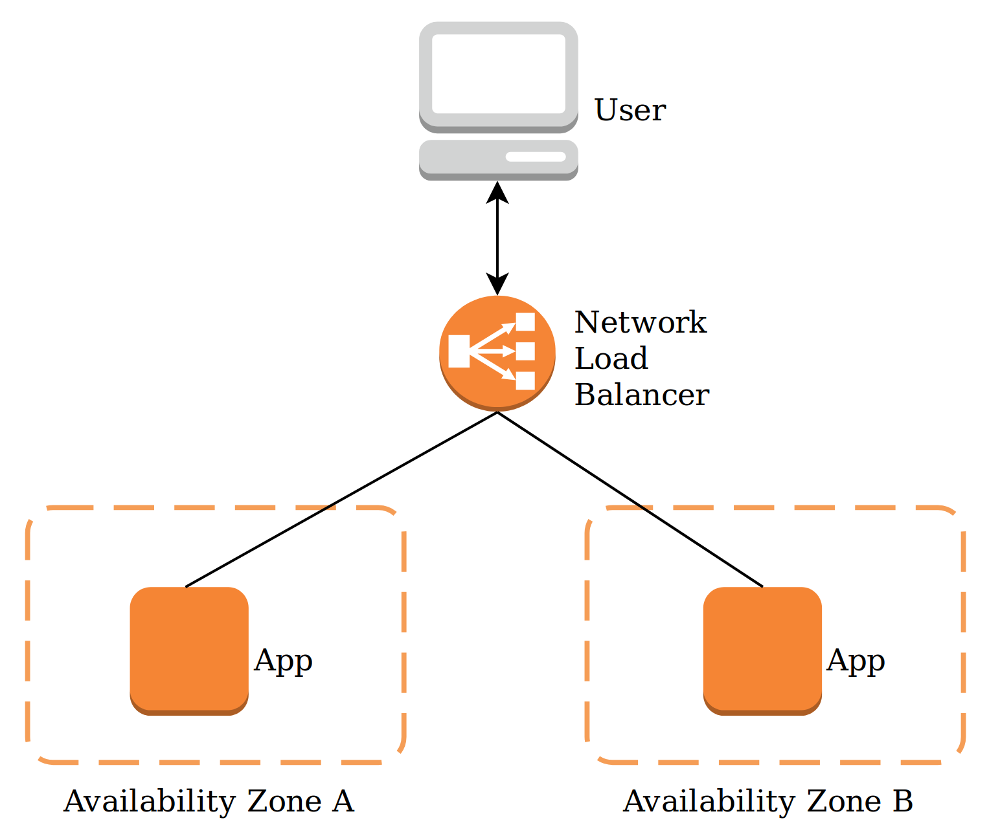
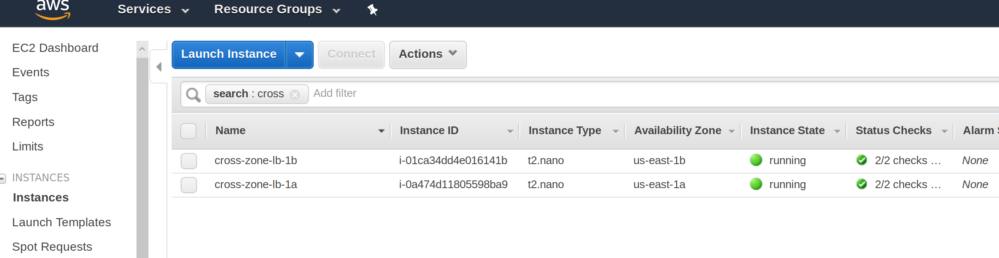
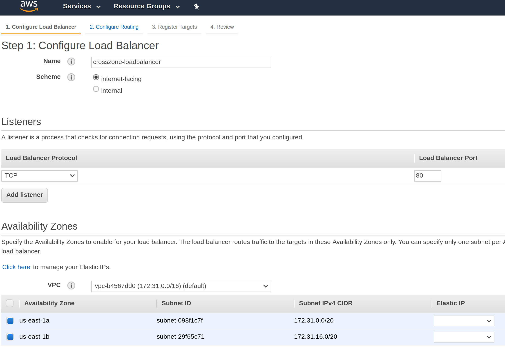
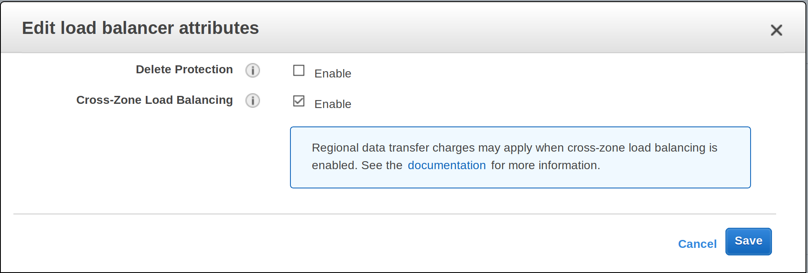
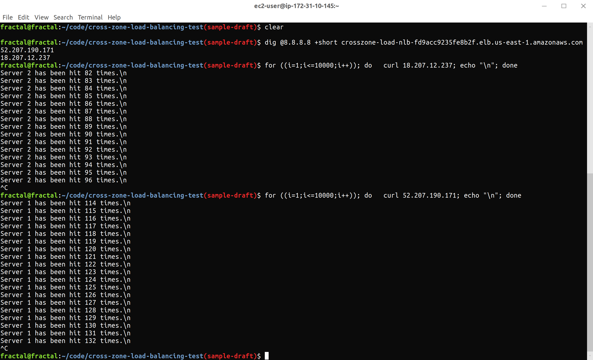
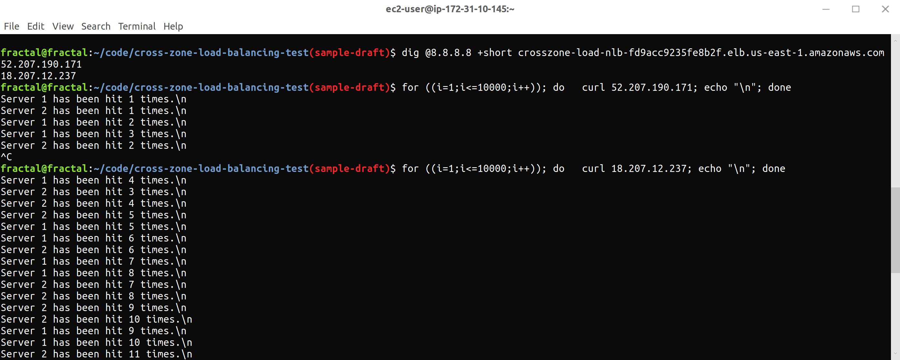

# When to use cross-zone load balancing?

* Load needs to be better balanced for traffic provisioning.

    By default, load balancers tend to prefer sending traffic to a particular destination due to [DNS caches](https://aws.amazon.com/about-aws/whats-new/2018/02/network-load-balancer-now-supports-cross-zone-load-balancing/). It fails over at the same rate, regardless of cross-zone load balancing. 
    
    In practice, when cross-zone load balancing is turned on, traffic routed from the load balancer to each of the destination servers in different availability zones will be balanced. Without it, the load balancer will prefer whichever server DNS resolves to first.

* Project requires slightly less failure rates upon failover.

    With cross-zone load balancing turned on, if one of two servers failed, error rates for incoming requests would be 50%, until the unhealthy host is taken out.

    With cross-zone load balancing turned off, and the cached DNS points to the server that failed (which is usually the case), the failure rates would be 100% until the unhealthy host is taken out.

    In practice, the unhealthy host usually takes about 1-60 seconds to be cycled out.

* Network Restriction / Network Policies.

    Perhaps due to some policy restriction, you're only allowed to provide one elastic IP for the load balancer. 
    
    For [Network Load Balancers](https://docs.aws.amazon.com/elasticloadbalancing/latest/network/introduction.html), there are one Elastic IP address for each availability zone. If you use just one IP address, it ensures only one availability zone would receive traffic, and that defeats the purpose of having multiple availability zones.

    By turning on [cross-zone load balancing](https://aws.amazon.com/about-aws/whats-new/2018/02/network-load-balancer-now-supports-cross-zone-load-balancing/), each of the elastic IP provided, is capable of routing to the other availability zone. This means that even with the limitation of using a single elastic IP, we can route traffic to multiple availability zones.

## Problem Statement

Recently, somebody asked me about what [Cross-Zone Load Balancing](https://aws.amazon.com/about-aws/whats-new/2018/02/network-load-balancer-now-supports-cross-zone-load-balancing/) on [AWS](https://aws.amazon.com) actually do, and whether it'll help solve a particular problem for them.

The problem that they're trying to solve revolves around the fact that they need to be able to achieve high availability via one static IP address utilizing a [Network Load Balancer](https://docs.aws.amazon.com/elasticloadbalancing/latest/network/introduction.html) targeting an application in some EC2 instances in multiple availability zones.

This repo is about using and testing [Cross-Zone Load Balancing](https://aws.amazon.com/about-aws/whats-new/2018/02/network-load-balancer-now-supports-cross-zone-load-balancing/) with AWS [Network Load Balancers](https://docs.aws.amazon.com/elasticloadbalancing/latest/network/introduction.html).

## Topics to Cover

### Load Balancers

[Load Balancers](https://en.wikipedia.org/wiki/Load_balancing_(computing)) are processes capable of distributing network load over different servers. Depending on how it is used, one may choose their own algorithm in **balancing** the network load to distribute it over their own clusters of servers.

AWS has an excellent [article](https://aws.amazon.com/elasticloadbalancing/) that outlines the different types of load balancers it supports.

### AWS Regions / Networking

When dealing with [cloud computing](https://en.wikipedia.org/wiki/Cloud_computing), it is important to take into consideration the location we host our application, and the type of different reliablility factor associated to that location.

In AWS, we may put an application in multiple different regions, and within those regions, we may choose multiple availability zones to host our application.

The [Regions & Availiability Zones](https://docs.aws.amazon.com/AWSEC2/latest/UserGuide/using-regions-availability-zones.html) article explains this in great detail.

## Testing

To test out how [Cross-Zone Load Balancing](https://aws.amazon.com/about-aws/whats-new/2018/02/network-load-balancer-now-supports-cross-zone-load-balancing/) interacts with [Network Load Balancers](https://docs.aws.amazon.com/elasticloadbalancing/latest/network/introduction.html), I hosted two identical web applications in two availability zone, and created a network load balancer forwarding traffic to the applications as a target group.

With that setup, we will then send requests to a load balancer elastic IP, ensuring that the load is balanced between the two application.

### Instructions

1. Create two EC2 (Amazon AMI) in a single region in 
two availability zone.  

1. SSH into each of the EC2 instance, and run `install-docker.sh` to install docker. 
1. Run `install-run-app.sh` in the EC2 instance to run the app.
1. Create a target group on those two EC2 instances.
1. Create and provision a [Network Load Balancers](https://docs.aws.amazon.com/elasticloadbalancing/latest/network/introduction.html) on this target group. It should be public-facing, and utilize two availability zone.

1. Create a security group and allow port 80 from the [private IP in the NLB to whitelist](https://docs.aws.amazon.com/elasticloadbalancing/latest/network/target-group-register-targets.html).
1. Put the security group on the two EC2 instances.
1. Ensure Cross Zone Load Balancing is off (off by default).
1. Look up the load balancer's DNS record by running `dig @8.8.8.8 +short <nlb-name>.elb.us-east-1.amazonaws.com`. You should now have two static IP addresses (one per subnet).
1. Hit a static IP with curl request `watch curl <IP address>` or use `sh verify-curl.sh <IP address>` to verify that with cross zone load balancing off, the load balancer will [mostly forward to one server](https://aws.amazon.com/about-aws/whats-new/2018/02/network-load-balancer-now-supports-cross-zone-load-balancing/). You may repeat this test with the other static IP.

1. SSH into the instance that the curl request is hitting most of the time, and shut down the application with `sh install-shutdown-docker.sh`.

1. You should now see a lot of requests failing before the load balancer wakes up and pushes it to the other server. Run `install-run-app.sh` to turn the application back on.

1. Turn on [Cross-Zone Load Balancing](https://docs.aws.amazon.com/elasticloadbalancing/latest/userguide/how-elastic-load-balancing-works.html#cross-zone-load-balancing) in the options of the Network Load Balancer, and wait a minute (testing shows it takes about 30 to a minute for the option to kick in).

1. Now repeat the test on sending requests on a provided static IP. The requests should now be roughly balanced and sent to both instances. Verify that requests to both static IPs hit both instances. 

1. Turn one of the applications off and verify that both static IP can hit the remaining instance provided.

## Results

### Cross-Zone Load Balance Off ###

### Cross-Zone Load Balance On ###

### Take away
The biggest take away here is that [when cross-zone load balancing is enabled, each load balancer node distributes traffic across the registered targets in all enabled Availability Zones](https://docs.aws.amazon.com/elasticloadbalancing/latest/userguide/how-elastic-load-balancing-works.html#cross-zone-load-balancing).

This solves the problem that provided a limitation of a single static IP address, we can still achieve high availability and balance the load correctly when failing over.
